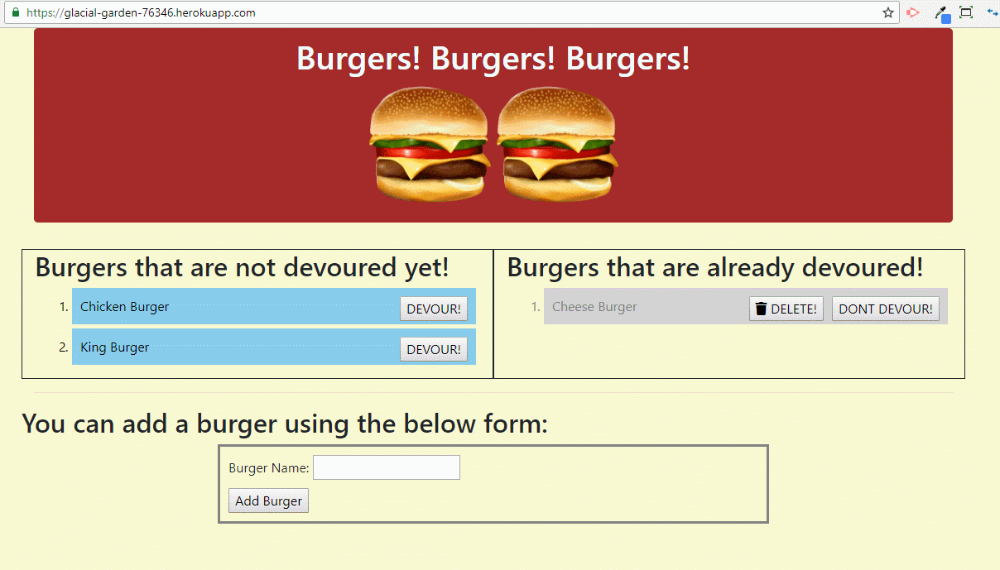

# burger
I developed this application using Handlebars, Express, Node & MySQL using MVC design pattern & native/basic ORM approach.  
This application allows a user to add a burger that will be initially displayed in the "Not Devoured" section. Then when one clicks 
on the "Devour" button, the entry shows up in the "Already Devoured"section!   
Once the burger is 'devoured' the user can click the Delete button to delete/remove that entry. This will delete that burger  
from the underlying db as well. 

I deployed this app to Heroku as well. One thing to note is that the deployed app on Heroku uses the JAWSDB_URL environment variable for db connection details. For locally hosted version, I am using an environment variable called "MYSQL_PWD" whose value I stored in an .env file. I then put .env as a file type in my .gitignore file. When testing/executing this app locally you need to have your own .env file and provide the value for MYSQL_PWD variable in it. 

Please see the gif below to showcase what I developed 

